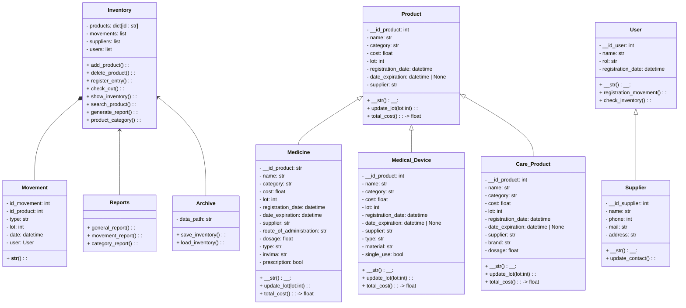

 # PROYECTO POO - EQUIPO ROCKET
# Sistema de Inventario para Bodega de Farmacia  
Proyecto Final – Programación Orientada a Objetos – Python

## Descripción General

Este proyecto simula un **sistema de gestión de inventarios para una bodega de farmacia**, desarrollado en **Python** utilizando **Programación Orientada a Objetos (POO)**.
Permite registrar productos, controlar entradas y salidas, generar reportes y mantener un historial organizado de todos los movimientos.
El sistema está diseñado para manejar diferentes tipos de productos, registrar los movimientos del inventario y generar reportes.

El sistema permite:
- Registrar productos de varias categorías (medicamentos, dispositivos médicos, productos de cuidado personal y venta libre).
- Registrar entradas y salidas del inventario.
- Consultar existencias, lotes, fechas de vencimiento y costos.
- Manejar proveedores y usuarios del sistema.
- Almacenar información de forma persistente mediante archivos **JSON**.
- Generar reportes del inventario y movimientos.
- Operar desde consola o desde una **GUI opcional en Tkinter**.

La solución fue diseñada para simular el funcionamiento real de una bodega de farmacia.

---

## Objetivo del Proyecto

Desarrollar una aplicación modular, escalable y orientada a objetos que gestione eficientemente el inventario de medicamentos y productos farmacéuticos, cumpliendo con las especificaciones del curso y buenas prácticas de POO.

---

## Justificación y Enfoque de la Solución

Para abordar el problema:
1. Se analizaron los procesos de inventario reales de bodegas de farmacia.  
2. Se clasificaron los productos según la industria farmacéutica:
   - Medicamentos  
   - Dispositivos médicos  
   - Productos de cuidado personal  
   - Productos de venta libre  
3. Se modelaron las clases principales siguiendo principios de:
   - **Abstracción**
   - **Encapsulamiento**
   - **Herencia**
   - **Modularidad**
4. Se estableció una estructura por paquetes para mantener el orden del proyecto.  
5. Se incluyó persistencia en JSON para mantener toda la información almacenada.
6. Se agregó una GUI opcional desarrollada con Tkinter para mejorar la interacción.

---

## Diagrama UML de Clases (Mermaid)

El siguiente diagrama representa la arquitectura final del sistema:



---

## Estructura

La organización del proyecto sigue una arquitectura modular dividida por las responsabilidades de cada clase.

```
inventario_farmacia/
│
├── src/
│   ├── productos/
│   │   ├── producto.py
│   │   ├── medicine.py
│   │   ├── medical_device.py
│   │   └── care_product.py
│   │
│   ├── gestion/
│   │   ├── inventory.py
│   │   ├── movement.py
│   │   └── supplier.py
│   │
│   ├── usuarios/
│   │   └── user.py
│   │
│   ├── persistencia/
│   │   ├── archive.py
│   │   └── json_manager.py  
│   │
│   ├── reportes/
│   │   └── reports.py
│   │
│   ├── gui/
│   │   ├── app.py
│   │   └── ventanas.py
│   │
│   ├── utils/
│   │   ├── fechas.py
│   │   └── validaciones.py
│   │
│   └── main.py
│
├── data/
│   ├── inventario.json
│   ├── movimientos.json
│   ├── proveedores.json
│   └── usuarios.json
│
└── README.md
```

- **productos/:** contiene las clases del modelo base (Product) y sus subclases especializadas (Medicine, MedicalDevice, CareProduct). Aquí se aplica la herencia y el manejo de atributos propios de cada tipo de producto.

- **gestion/:** agrupa el control del inventario (Inventory), el registro de movimientos (Movement) y la gestión de proveedores (Supplier).

- **usuarios/:** define la clase User, que representa a los usuarios del sistema y sus acciones dentro del inventario.

- **persistencia/:** maneja la lectura y escritura de datos en archivos JSON.

- **reportes/:** genera informes basados en la información del inventario y los movimientos almacenados.

- **gui/:** contiene la interfaz gráfica construida con Tkinter.

- **utils/:** funciones auxiliares como validación de datos y manejo de fechas.

- **main.py:** punto de entrada que inicia el sistema y conecta los módulos.

- **data/:** almacena los archivos JSON donde persisten los productos, movimientos, proveedores y usuarios.


---

### Equipo Rocket

- Integrantes:
  
  - Carol Tatiana Alfonso Valderrama
  - Maria Fernanda Arias FLorez
  - Juan Nicolá Gutiérrez Coral


