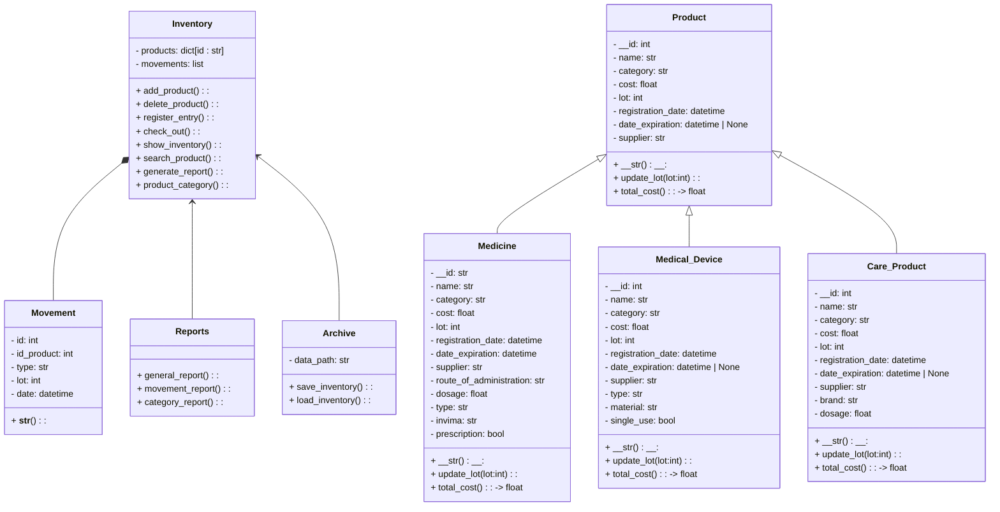

# PROYECTO POO - EQUIPO ROCKET

## Sistema de gestión de inventario
Este proyecto es una aplicación en Python que simula un sistema de gestión de inventario para la bodega de una farmacia. Permite registrar productos, controlar entradas y salidas, generar reportes y mantener un historial organizado de todos los movimientos.
El sistema está diseñado para manejar diferentes tipos de productos, registrar los movimientos del inventario y generar reportes.

## Diagrama de clases

.



## ¿Cómo funciona?
Nuestro diagrama esta compuestos por distintas clases:


### Product (Clase base)
Es la clase principal de donde salen los demás productos. Sus atributos son:
- __id
- nombre
- categoría
- costo
- lote
- proveedor
- fecha de registro
- fecha de vencimiento

Sus metodos son:
- update_lot(): para actualizar el lote
- total_cost(): precio total del stock
- str(): mostrarlo como texto

Y sus tres clases hijas **(Herencia)*: 
- Medicine
- Medical_Device
- Care_Product


### Inventory (Clase base)
Es la clase más importante porque maneja todo el sistema. Aquí se guardan:
- Los productos (en un diccionario)
- La lista de movimientos

Sus metodos son:
- **add_product()** = Agregar productos
- **delete_product()** = Eliminar productos
- **register_entry()** = Registrar entrada
- **check_out()** = Registrar salida
- **show_inventory()** = Mostrar inventario
- **earch_product()** = Buscar producto
- **generate_report()** = Genrar reporte
- **product_category()** = Categoria de producto


### Movement
Guarda los cambios que le pasan a los productos. 
Sus métodos son:
- id
- id del producto
- tipo (entrada o salida)
- lote afectado
- fecha del movimiento


### Archive and Reports
Archive se encarga de guardar y cargar los datos del inventario. Mientras que Reports genera reportes con base en la información del inventario.
Ambas depenten de la clase "Inventory"

## Organización de Modulos y Paquetes:
Así mismo, se espera al momento de programar el código, este se organice de la siguiente manera:
```csv
Sistema de Inventario de Farmacia
│
├── Product (clase base)
│   ├── Medicine
│   ├── Medical_Device
│   ├── Care_Product
│
├── Inventory
│   ├── Manages products and transactions
│   ├── Calculates values, expiration dates, and low stock levels
│   └── Generates reports
│
├── Movement
├── Archive
└── Reports
```
